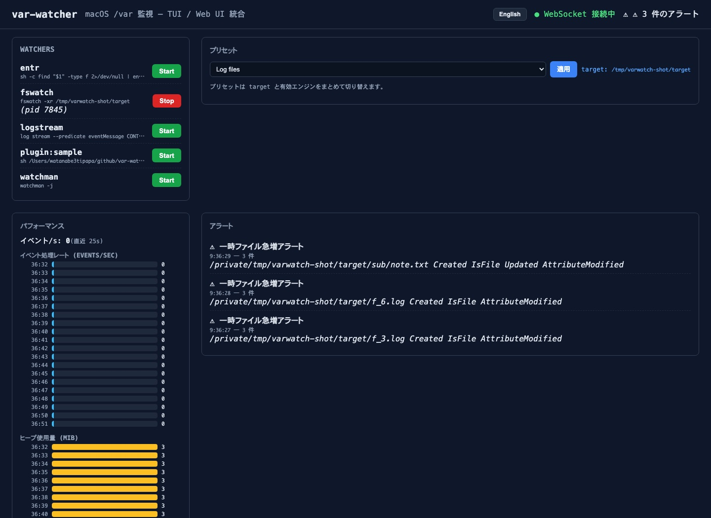

<!-- badges -->

[日本語](README.md) | [English](README_en.md)

# var-watcher

A macOS-focused monitoring tool (educational) that observes `/var` in real time. It unifies four monitoring engines (`fswatch`, `watchman`, `entr`, and `log stream`) behind a single TUI and a Web UI.

- TUI: `varwatch --tui` (implemented with tview)
- Web UI: `varwatch --web` (Vue 3 + WebSocket, embedded in the binary)
- Both: `varwatch --tui --web` (shared state and logs)

Homepage / documentation: https://watanabe3tipapa.github.io/var-watcher/

## Overview / Motivation

var-watcher was created to visualize filesystem footprints under macOS `/var` in real time. The project is aimed at observing changes (files created/modified/deleted, logs, caches, temporary files) that can serve as a footprint of external activity. The tool reports what changed on the filesystem; it does not attempt to infer reasoning or decisions of agents that caused the changes.

## Main features

- Unified control of multiple monitoring engines (fswatch / watchman / entr / log stream)
- Real-time logs streamed to both TUI and Web UI (via WebSocket)
- Log filtering in the TUI (keyword search)
- Event deduplication: identical events collapse into one line within a `dedup_ms` window (LRU)
- Persistent log storage + search: SQLite (pure Go, no CGO), searchable via `/api/logs` (time range / keyword / source)
- Rule-based alerts: fire when a pattern matches N times within a window; macOS notification (optional sound) + Web badge
- Persistent configuration (stored at `~/.varwatch/config.json`)
- macOS notifications via `osascript`
- Plugin support: drop scripts into `plugins/` and they run automatically
- Dependency detection with hints to install missing tools
- Single binary distribution: the Web UI is embedded using Go's embed.FS

## Screenshot

## Requirements

- macOS (the project targets monitoring `/var` on macOS)
- Go toolchain (go.mod indicates Go 1.26)
- Optional monitoring engine tools (examples shown in Installation)

## Installation (verified steps)

The repository provides a Makefile with convenient targets. The README and Makefile include the following example steps:

1. Install optional monitoring engines (example via Homebrew):

   brew install fswatch watchman entr

2. Clone and build the project:

   git clone https://github.com/watanabe3tipapa/var-watcher.git
   cd var-watcher
   make build

3. (Optional) Put the built binary on your PATH:

   sudo mv varwatch /usr/local/bin/

The Makefile also contains targets for development and frontend build:

- make dev: runs `go run ./cmd/varwatch --tui`
- make frontend: builds the frontend (runs npm in `frontend/` and copies built assets to `internal/web/dist`)

## Usage (commands shown in repository)

Examples from the project README and Makefile:

  varwatch --tui                  # Terminal UI
  varwatch --web                  # Web UI at http://localhost:8080
  varwatch --tui --web            # Both simultaneously
  varwatch --config /path.json    # Use a custom config file

Note: `/var` often requires elevated privileges on macOS. The original README notes running the TUI with `sudo` when monitoring `/var`. Running `--web` alone does not require root privileges.

## Documentation and additional references

- Project documentation / site: https://watanabe3tipapa.github.io/var-watcher/
- DEV notes in repository: DEV-MEMO.md
- Live demo (hosted): https://var-watcher.netlify.app

## Project structure (top-level files / directories present)

The repository includes, among others, the following entries (as present in the repository root):

- cmd/         (Go command sources)
- frontend/    (Vue frontend sources)
- internal/    (internal Go packages, includes embedded web assets)
- plugins/     (plugin scripts)
- demo/        (demo site)
- astro/       (static site tooling)
- assets/      (images and static assets)
- Makefile
- DEV-MEMO.md
- LICENSE

## Contributing

Contributions are welcome. The repository README includes these basic steps:

1. Fork the repository
2. Create a feature branch (`git checkout -b feature/name`)
3. Commit your changes
4. Push the branch
5. Open a Pull Request on GitHub

For more context and project-specific notes, consult DEV-MEMO.md and the documentation site.

## Development / Maintenance status

The repository indicates an active maintenance status (see badge in header). Refer to the commit history for recent activity.

## License

This project is licensed under the MIT License — see the LICENSE file in the repository for details.

## Contact

GitHub: https://github.com/watanabe3tipapa/var-watcher
Homepage / Docs: https://watanabe3tipapa.github.io/var-watcher/
